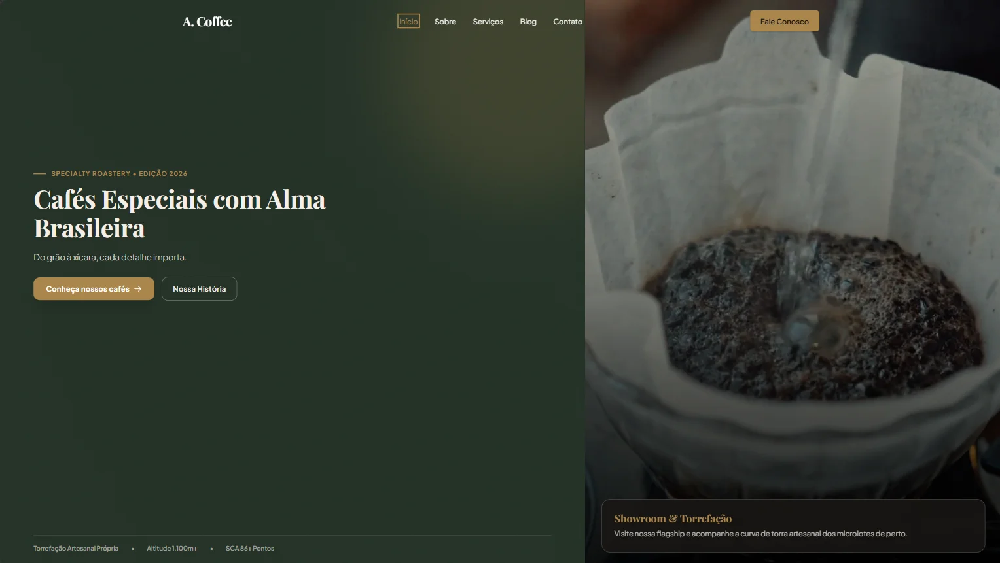
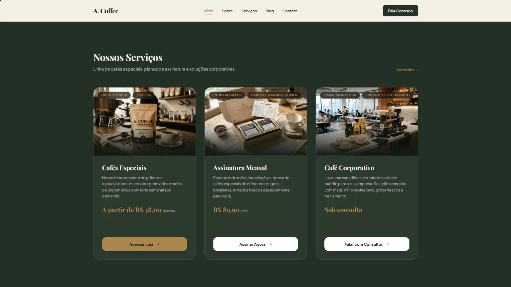
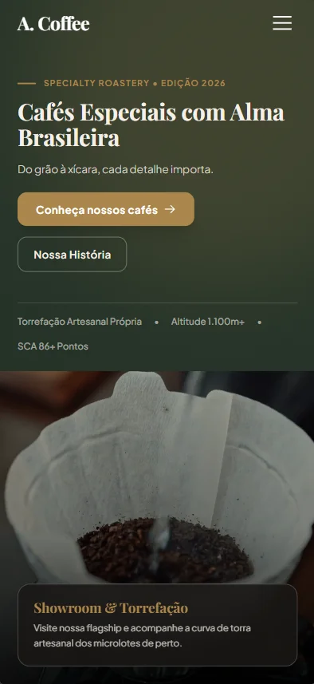
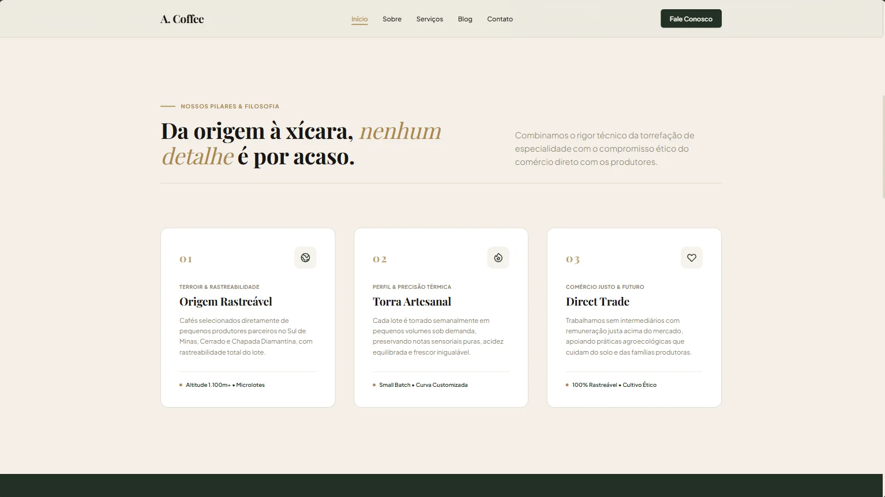
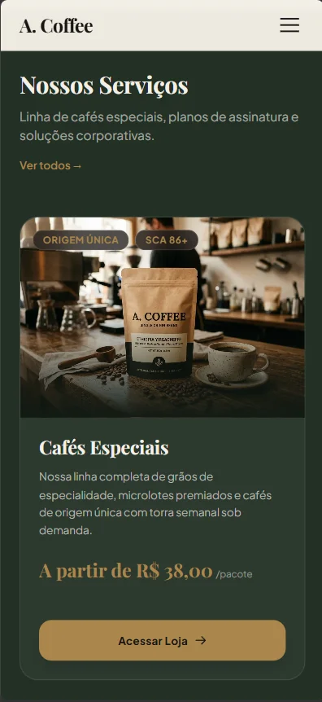
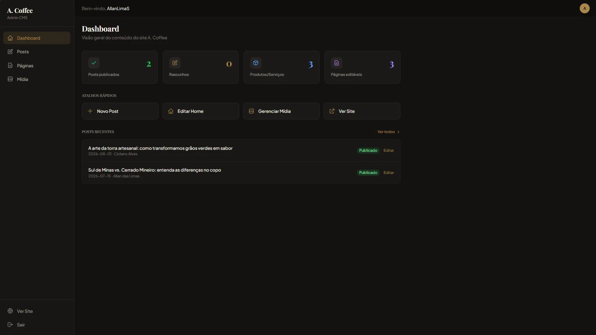
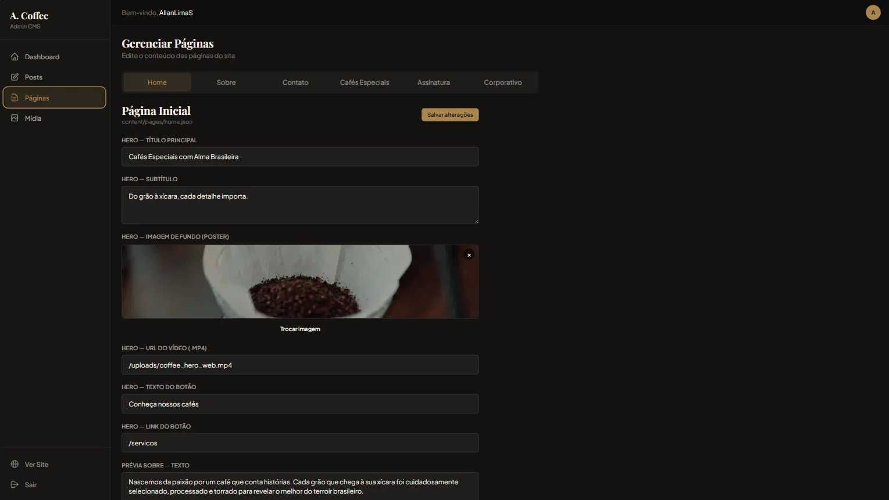
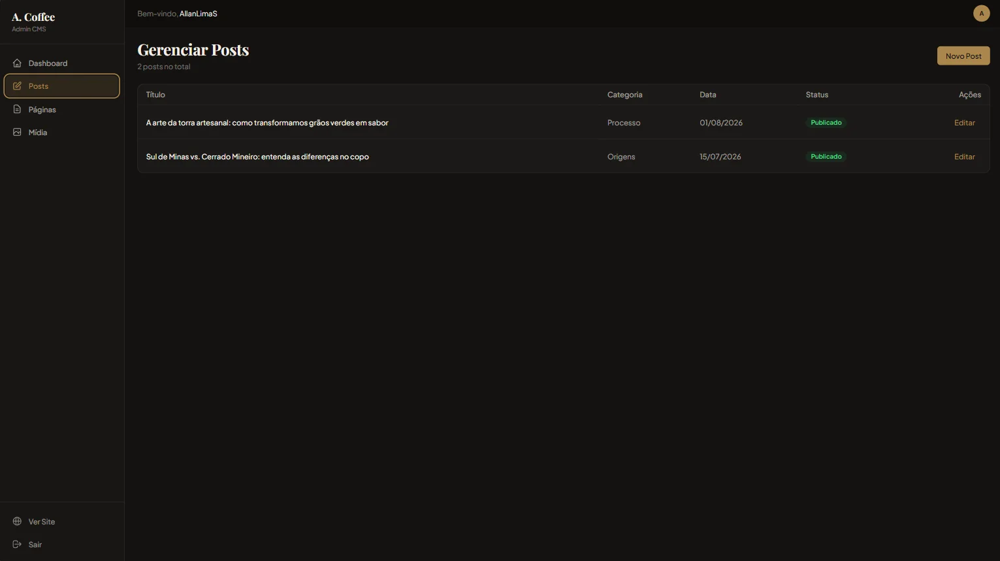

<div align="center">

# ☕ A. Coffee — Website Institucional & CMS Git-Based

[](https://nextjs.org/)
[](https://react.dev/)
[](https://www.typescriptlang.org/)
[](https://tailwindcss.com/)
[](https://next-auth.js.org/)
[](https://a-coffee-website-rosy.vercel.app)

[🌐 **Acessar Site ao Vivo**](https://a-coffee.allanlimas.com.br) • [💼 **Meu Portfólio**](https://allanlimas.com.br)

</div>

---

## 📌 Sobre o Projeto

Este é um projeto de portfólio desenvolvido para demonstrar competências práticas em duas frentes complementares de desenvolvimento web:

1. **Site Institucional:** Uma experiência digital moderna, editorial e responsiva para uma marca de cafés especiais, priorizando tipografia e performance estática (**SSG**).
2. **Headless CMS Git-Based (Custo Zero):** Um painel administrativo próprio integrado diretamente à **GitHub REST API**, permitindo criar, editar e publicar conteúdos (JSON/Markdown) e mídias sem depender de banco de dados SQL pago ou serviços externos de CMS.

---

## 🌐 1. O Site Institucional

O site público foi construído com foco em estética editorial, tempos de carregamento instantâneos e ótima usabilidade tanto em desktop quanto no mobile.

* **Hero Edge-to-Edge:** Vídeo em loop silencioso de alta definição com streaming progressivo (`faststart`), poster instantâneo e altura de 100vh em desktop.
* **Modais Interativos:** Simulação de e-commerce e prévia de direcionamento para atendimento via WhatsApp com mensagens personalizadas por serviço.
* **SEO & Performance:** Geração 100% estática (**SSG/ISR**), metadados OpenGraph ricos, `sitemap.xml` e `robots.txt` automatizados.

### 🖥️ Demonstração Visual (Desktop & Mobile)

<div align="center">
  
</div>

<br/>

<div align="center">
  <table>
    <tr>
      <td width="65%" align="center">
        <b>Serviços & Produtos (Desktop)</b><br/>
        
      </td>
      <td width="35%" align="center">
        <b>Mobile (Hero 100vh)</b><br/>
        
      </td>
    </tr>
    <tr>
      <td width="65%" align="center">
        <b>Sobre Nós & Valores (Desktop)</b><br/>
        
      </td>
      <td width="35%" align="center">
        <b>Mobile (Serviços & Modais)</b><br/>
        
      </td>
    </tr>
  </table>
</div>

### 🎥 Tour em Vídeo (Demonstração Completa)
Assista a um tour rápido de 40 segundos pelas páginas, modais interativos e painel administrativo CMS:

https://github.com/AllanLimaS/a-coffee-website/raw/master/docs/a_coffee_demo_mini.mp4

> 🎬 **[▶️ Clique aqui para abrir e assistir o vídeo da demonstração (1.2 MB)](docs/a_coffee_demo_mini.mp4)**  
> *(Disponível também na versão de alta definição em [docs/a_coffee_demo.webm](docs/a_coffee_demo.webm))*

---

## ⚙️ 2. O CMS Customizado (Git as a Database)

O painel administrativo em `/admin` funciona como uma camada visual para o repositório GitHub, unindo simplicidade de uso e custo zero de infraestrutura.

* **Autenticação Segura:** Login social via **GitHub OAuth** com validação de lista de permissões (`ADMIN_USERS whitelist`).
* **Edição em Tempo Real:** Alteração de textos, links, vídeos e imagens das páginas com gravação direta de commits no Git através de rotas de API serverless.
* **Gestão de Blog & Mídia:** Suporte a postagens em Markdown com preview e galeria de mídia com compressão automática em **WebP** usando **Sharp**.

### 📸 Telas do Painel Administrativo

<div align="center">
  <table>
    <tr>
      <td width="50%" align="center">
        <b>Dashboard Geral</b><br/>
        
      </td>
      <td width="50%" align="center">
        <b>Editor Visual de Páginas</b><br/>
        
      </td>
    </tr>
    <tr>
      <td colspan="2" align="center">
        <b>Gerenciamento de Posts do Blog</b><br/>
        
      </td>
    </tr>
  </table>
</div>

---

## 🛠️ Stack Tecnológica

| Camada | Tecnologia |
|---|---|
| **Framework** | Next.js 15 (App Router) + React 19 |
| **Linguagem** | TypeScript 5 |
| **Estilização** | Tailwind CSS 4 & Vanilla CSS |
| **Autenticação** | NextAuth.js (GitHub OAuth) |
| **Engine de Conteúdo** | GitHub REST API + JSON/Markdown |
| **Processamento de Mídia** | Sharp (WebP) + FFmpeg (H.264/VP9) |
| **Hospedagem & Deploy** | Vercel (Edge Network / CI/CD) |

---

## 🚀 Executando o Projeto Localmente

1. **Clonar e instalar dependências:**
   ```bash
   git clone https://github.com/AllanLimaS/a-coffee-website.git
   cd a-coffee-website
   npm install
   ```

2. **Configurar variáveis (`.env.local`):**
   ```env
   NEXTAUTH_URL=http://localhost:3000
   NEXTAUTH_SECRET=seu-hash-criptografico-de-32-caracteres

   GITHUB_CLIENT_ID=seu-github-oauth-client-id
   GITHUB_CLIENT_SECRET=seu-github-oauth-client-secret
   GITHUB_TOKEN=seu-personal-access-token
   GITHUB_OWNER=seu-usuario-github
   GITHUB_REPO=a-coffee-website
   ADMIN_USERS=seu-usuario-github
   ```

3. **Iniciar o servidor:**
   ```bash
   npm run dev
   ```
   Acesse **[http://localhost:3000](http://localhost:3000)**.

---

<div align="center">
  <sub>Projeto desenvolvido para fins de demonstração técnica de portfólio.</sub>
</div>
